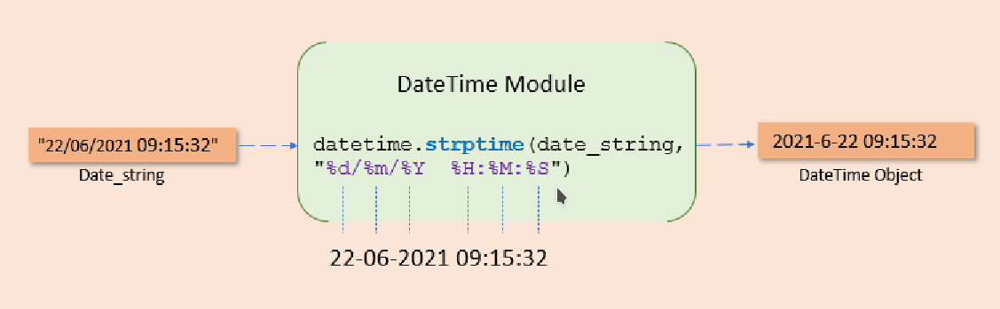
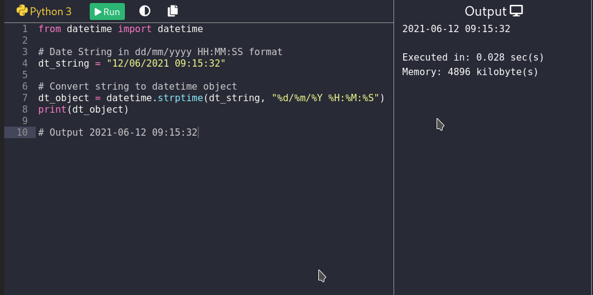

## Useful utility programs

Useful utility programs, just to represent some know how to do it!

### Python String to DateTime using strptime()
https://pynative.com/python-string-to-datetime-strptime/

Useful utility programs to convert date from native SQL format
to datetime format, suitable to present date as datetime format.

The following picture shows how to convert date from string
format to datetime format.

Here is the python simulator, which can show the String to
DateTime conversion:

https://pynative.com/online-python-code-editor-to-execute-python-code/

The code to be entered to the simulator is shown on the following
picture:

