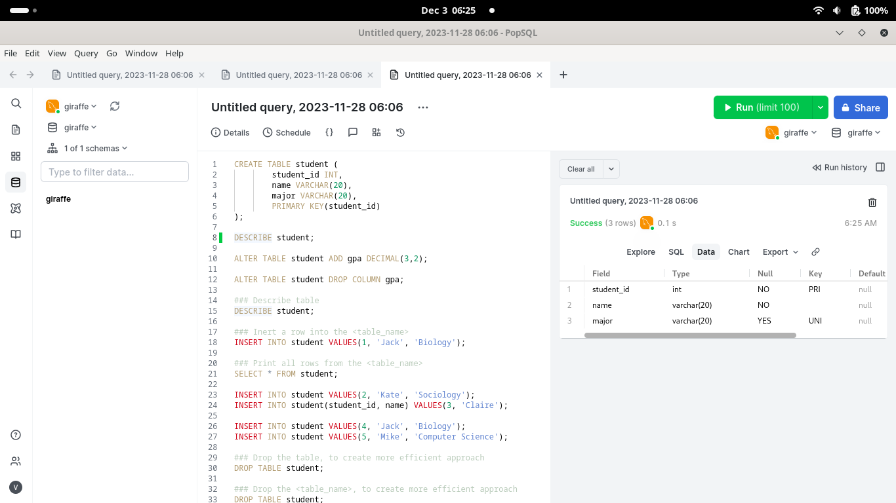
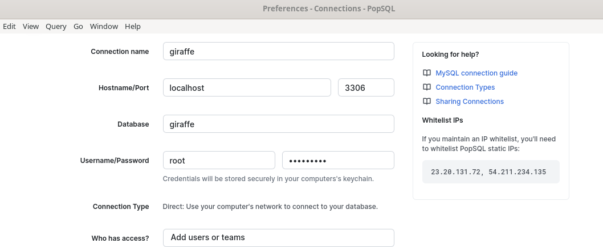

### PopSQL Client IDE Installation

Please, go to the PopSQL home page, to get familiar with MySQL
PopSQL IDE client.

* [PopSQL home page](https://popsql.com/)

Please, register to use PopSQL client!

* [Register to use PopSQL IDE client](https://popsql.com/users/sign_up)

From the www web client, some registration must be done:

* [PopSQL account](https://popsql.com/account)

Please, do note that this is just an example registration:

Account		John_Doe

Logged in as John Doe (john.doe@gmail.com).

Personal details:

First name	John
Last name	Doe
Email		john.doe@gmail.com

The download client executable image: PopSQL-1.0.127.AppImage .

This image for Linux is called PopSQL-1.0.127.AppImage, and must
be initially configured.

#### Two pictures posted from ./PopSQL-1.0.127.AppImage&

##### This picture shows the PopSQL IDE environment:

##### This picture shows PopSQL setup:

TCP port: 3306, usage: DIRECT, host: localhost (127.0.0.1)
